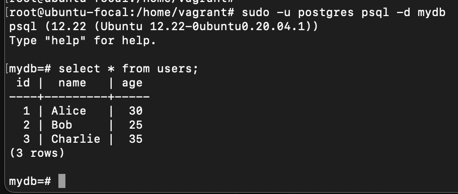

## Part 1. Удаленное конфигурирование узла через Ansible

1. Создать с помощью Vagrant три машины - manager, node01, node02. Не устанавливать с помощью shell-скриптов docker при создании машин на Vagrant! Прокинуть порты node01 на локальную машину для доступа к пока еще не развернутому микросервисному приложению.

    Также была создана машина ansiblevm для выполнения на ней playbook ансибл по настройке машины manager. Благодаря ansiblevm не нужно руками подготавливать manager как рабочую станцию.

    

2. Подготовить manager как рабочую станцию для удаленного конфигурирования (помощь по Ansible в материалах).

    Зайти на manager.
    На manager проверить подключение к node01 через ssh по приватной сети.
    Сгенерировать ssh-ключ для подключения к node01 из manager (без passphrase).
    Скопировать на manager docker-compose файл и исходный код микросервисов. (Используй проект из папки src и docker-compose файл из предыдущей главы. Помощь по ssh в материалах.)
    Установить Ansible на менеджер и создать папку ansible, в которой создать inventory-файл.
    Использовать модуль ping для проверки подключения через Ansible.
    Результат выполнения модуля поместить в отчет.

    Данные инструкции прописаны в playbook.yml который выполняется автоматически при создании всех машин vagrant

    

3. Написать первый плейбук для Ansible, который выполняет apt update, устанавливает docker, docker-compose, копирует compose-файл из manager'а и разворачивает микросервисное приложение.

    Данный плейбук представляет из себя playbook_1.yml, который на node01 разворачивает приложение.

    

4. Прогнать заготовленные тесты через postman и удостовериться, что все они проходят успешно. В отчете отобразить результаты тестирования.

    

5. Сформировать три роли:

    роль application выполняет развертывание микросервисного приложения при помощи docker-compose,
    apache устанавливает и запускает стандартный apache сервер
    postgres устанавливает и запускает postgres, создает базу данных с произвольной таблицей и добавляет в нее три произвольные записи.
    Назначить первую роль node01 и вторые две роли node02, проверить postman-тестами работоспособность микросервисного приложения, удостовериться в доступности postgres и apache-сервера. Для Apache веб-страница должна открыться в браузере. Что касается PostgreSQL, необходимо подключиться с локальной машины и отобразить содержимое ранее созданной таблицы с данными.

    Плейбук deploy_roles.yml включает в себя описанный выше роли для node01 и node02

    Тесты postman проходят:

    

    Таблица в postrgres создана

    

    Apache веб страница доступна

    

## Part 2. Service Discovery

Сымитировать два удаленных сервиса - api и БД. Осуществить между ними подключение через Service Discovery с использованием Conula.

1. Написать два конфигурационных файла для consul

    Важным параметром для запуска как консул агента так и консул сервера стал флаг -grps=8502 благодаря которому sidecar сервис присоединяет consul-envoy ```/usr/local/bin/consul agent -grpc-port=8502 -config-file=/etc/consul.d/consul_client.hcl```
 
    * consul_server.hcl
        * Настроить агент как сервер
        

    * consul_client.hcl
        * Настроить агент как клиент
        

2. Создать с помощью Vagrant четыре машины - consul_server, api, manager, db. Также для более удобного настраивания машины manager была развернута доп машина ansiblevm, на которой проходит playbook.yml по настройке manager
    * Прокинуть порт 8082 с api на локальную машину для доступа к пока еще не развернутому api
    * Прокинуть порт 8500 с consul_server для доступа к ui consul

3. Написать плейбук для ansible и четыре роли. Так как я столкнулся с проблемой сопосталяемости версий consul и envoy, а также недоступность сборки для консула без впн, то скачала заранее нужную сборку и положил в files этой роли
    * install_consul_server, которая
        * работает с consul_server
        * копирует consul_server.hcl
        * устанавливает consul и необходимые для consul зависимости
        * запускает сервис consul
        

    Для Envoy тоже использовал специально скачанную сборку curl ом    
    * install_consul_client
        * работает с api и db
        * копирует consul_client.hcl
        * устанавливает consul, envoy и необходимые для consul зависимости
        * запускает сервис consul и consul-envoy
        

    * install_db
        * работает с db
        * устанавливает postgres и запускает его
        * создает базу данных hotels_db
        

    На сервере БД и АПИ важно какие имена у сервисов и порты (envoy.json), так как envoy может просто не соединить бд и отель. Можно обратить внимание, что отель ищет бд на локалхост а подключается к ней на совсем другом хосте, именно для этого и нужен sidecat proxy
    
    * install_hotels_service
        * работает с api 
        * копирует исходный код сервиса 
        * устанавливает openjdk-9-jdk
        * создает глобальные переменные окружение
            * POSTGRES_HOST="127.0.0.1"
            * POSTGRES_PORT="5432"
            * POSTGRES_DB="hotels_db"
            * POSTGRES_USER="имя пользователя"
            * POSTGRES_PASSWORD="пароь пользователя"
        * запускает собранный jar-файл командой java -jar <путь до hotel-service>/hotel-service/target/<имя jar-файла>.jar
        

4. Проверить работоспособность CRUD-операций над сервисом отелей.

    